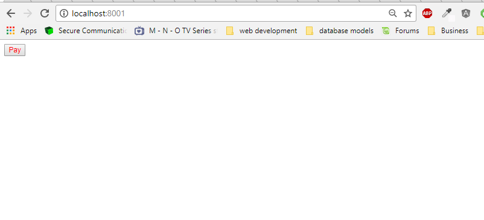
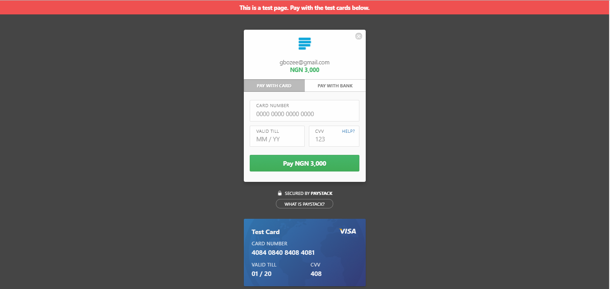
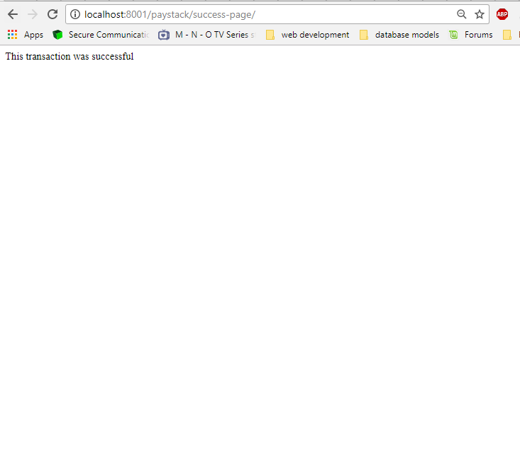

## PyPaystack

[](https://travis-ci.org/gbozee/django-paystack.svg?branch=master
)


This is a reusable python library that makes it very easy to hook up [Paystack]() purchase button to your site/app. Framework specific integration e.g [Django]() and [Starlette]() are provided by default.
The library also helps with verification of transactions and is highly configurable.

Usage:
1. Install `pypaystack`
```
pip install -e git+https://github.com/gbozee/pypaystack.git@master#egg=pypaystack
```

### Django Specific Setup

2. Add `paystack` to your `settings` module
```
INSTALLED_APPS = [
    ...,
    paystack,

]
```

3. Add `url(r'^paystack/', include('paystack.urls',namespace='paystack'))` to your base `urls.py` file
```
urlpatterns = [
    ...,
    url(r'^paystack/', include('paystack.urls',namespace='paystack')),
]
```
  **NB**: for django 2.0 and above, your `urls.py` would look like this

```
   from django.url import path, include
urlpatterns = [
   ...,
   path("paystack", include(('paystack.urls','paystack'),namespace='paystack')),
]
```
4. Login to [Paystack settings Dashboard](https://dashboard.paystack.com/#/settings/developer) and fetch your `PUBLIC_KEY` and `SECRET_KEY`. paste these keys in your `settings.py`

```
# settings.py

PAYSTACK_PUBLIC_KEY=******,
PAYSTACK_SECRET_KEY=******
```


5. In the html where you want to insert the payment button

```

...


```

6. A `signal` is provided with the verified  reference as well as the amount

```
from paystack.signals import payment_verified

from django.dispatch import receiver

@receiver(payment_verified)
def on_payment_verified(sender, ref,amount, **kwargs):
    """
    ref: paystack reference sent back.
    amount: amount in Naira.
    """
    pass
```

### Starlette Specific setup

### Configurations

**Required**

`PAYSTACK_PUBLIC_KEY`

`PAYSTACK_SECRET_KEY`

_Optional_

`PAYSTACK_FAILED_URL` # Redirect url when payment fails, default is `paystack:failed_url`

`PAYSTACK_SUCCESS_URL` # Redirect url when payment is successful, default is `paystack:success_url`

`PAYSTACK_LIB_MODULE` # module directory to overide default implemenation of library that calls paystack api, default is `paystack.utils`


### Template Tag Usage

the template tag `paystack_button` takes the following argument

`button_class`: css class to style the button

`button_id`: id name for the button: default is "django-paystack-button"

`email`: a required field representing the email

`amount`: a required the amount to be paid in Naira. `

`ref`: an optional field representing the reference of the transaction`

`redirect_url`: an optional field representing the redirect url after payment has been made, defaults to `paystack:verify_payment`

**NB**: *If you prefer using css to style html tags, the id of the button is *


**To view the sample test project, do the following**
```
$ git clone https://github.com/gbozee/django-paystack.git
$ git checkout develop
$ pip install -r requirements.txt
$ pip install -e .

```

**NB:** If you use [pipenv](), do the following
```
$ pipenv install

```

To run the project
```
$ cd django_paystack
$ python manage.py runserver

```









## Extending
The default templates used can be extended to include your custom content.

1. Create a `paystack` directory in your `templates` folder.

The templates used are as follows.

```
paystack/failed-page.html
paystack/success-page.html
```

## Webhook.
In order to listen and respond to events that happen from the paystack dashboard on your site, you are required as a developer to provide a publicly available url as a webhook.

This library provides the webhook url and exposes a signal for you to listen to and respond to any event sent by paystack

```
from paystack.signals import event_signal
from django.dispatch import receiver

@reciever(event_signal)
def on_event_received(sender, event, data):
   # sender is the raw request
   # event is the event name that was passed https://developers.paystack.co/docs/events
   # data is the available data tied to the event
   pass
```

You would need to register the following url
`http://<domain_name>/paystack/webhook/`

whatever your `<domain_name> ` is, you would need to set it to `PAYSTACK_WEBHOOK_DOMAIN` in your `settings.py`

for example, assuming you are using ngrok during development, in your `settings.py` add the following config

```
PAYSTACK_WEBHOOK_DOMAIN=13232323.ngrok.io
```

and your webhook url that you would paste at paystack dashboard would be 
http://13232323.ngrok.io/paystack/webhook/
